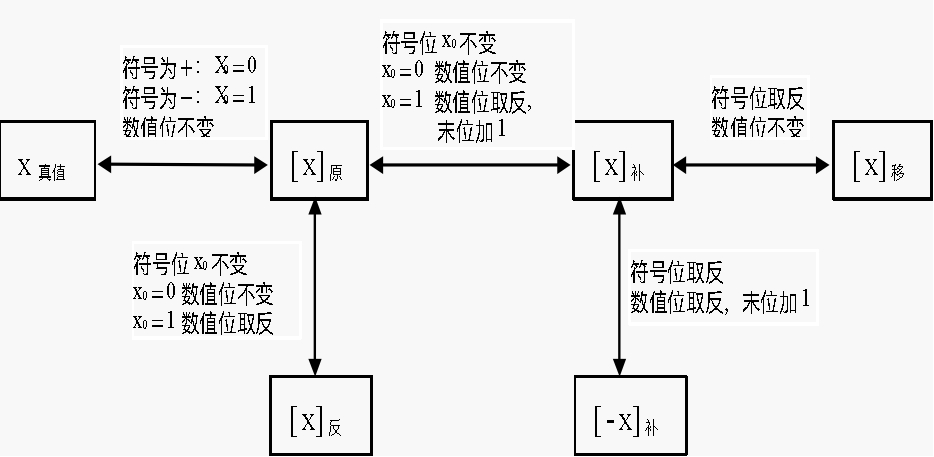
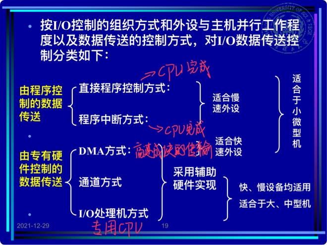
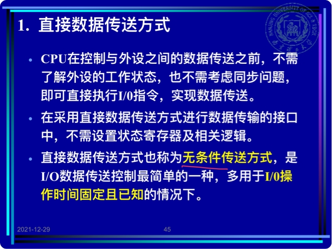
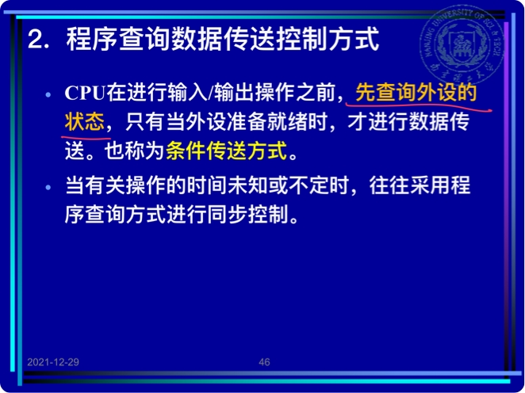
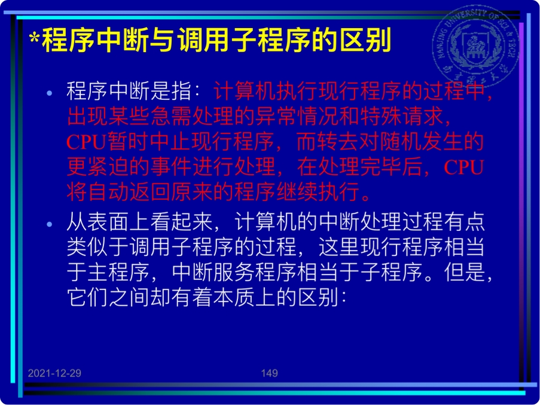

# 一、引论

## 计算机功能部件

计算机的基本功能：数据加工、数据保存、数据传送、操作控制。相应的有硬件的五大部件，他们组成了计算机系统的体系结构。

> 1. 存储器分为主存储器（内存、外存）和辅助存储器（外存、辅存）
>
> 2. 存储器的访问方式
>
>    * 按地址进行访问
>    * 按内容进行访问（相联存储器）
>
> 3. 主存的基本组成
>
>    

程序：解题步骤，控制器按照事先安排好的步骤，控制计算机各个部件有条不紊的自动工作。

程序按照指令序列的形式存放在存储器中，控制器一次读出存储器中的程序质量实施控制。这种方式叫做**存储程序方式**

早期冯·诺伊曼计算机**以运算器为中心**，现代计算机逐步转变为**以存储器为中心**

现代计算机结构依然遵循冯诺依曼思想。

## 计算机软件

基本的软件系统包含**系统软件** 和**应用软件**两大类

## 计算机系统的组织结构

硬件、软件在逻辑功能上是等价的。

计算机系统结构是多层次的。

### 计算机硬件的系统结构

现代计算机普遍采用总线结构

总线的使用规定：分时发送，同时接收。（发送部件需要分时使用总线发送信息，但是各个部件可以同时接收到总线的数据）

> 总线的分类
>
> 按照任务：cpu内部总线、部件内部总线、系统总线、外总线
>
> 按照信息传送方向：单向总线、双向总线
>
> 按照总线的信息传送位数：串行、并行

## 计算机性能指标

1. 基本字长：范围和精度
2. 主存容量：程序复杂性
3. 运算速度
4. 外部设备
5. 软件配置

# 二、计算机中数据信息的表示

## 数制与数制转换

进位计数值都有两个基本因素：**基值**，**位权值**

任意进制转换为十进制：按权相加

十进制转换为任意进制：整数部分、小数部分分别进行转换，整数部分除基取余（逆序），小数部分乘基取整（顺序）

## 带符号数的表示

### 1. 机器数

机器数是连同数字一起代码化的数据，小数点本身是隐含的。

机器数分为有符号数和无符号数，指令想知道机器数是否带符号，由指令的操作码决定。

真值=符号位+绝对值

> 四种机器码：原码、补码、反码和移码

### 2.原码表示

文字定义：数值部分的形式不变，只将符号用二进制代码表示

公式定义

原码的移位规则：符号位不变，数值部分左移或者右移，移出的空位补0。左移将有效位移出会导致移除错误。

### 3.补码表示

目的：为了解决原码的加减运算的不方便

公式定义

从定义可以看出，相对于原码的整数表数范围变大了（所表示最小值更小了）

> 补码求法：对原码，**符号位不变，从后面往前数到第一个1，上述不变，前面的位数全部取反**。

真值和补码的映射关系图

补码的移位规则：

* 右移：符号位不变，数值位右移，高位补符号位
* 左移：连同符号位左移，低位补0，注意会溢出

> 补码的模
>
> * 补码总是对于确定的模而言的。如果补码运算的结果超过了模，会自动取模
> * 补码在运算过程中，模不可以改变
> * 为了使得不同位数补码可以求和，需**符号扩展**，方法是扩充符号位

### 4.反码表示

公式定义：

> 反码求法：
>
> * 正数不变
> * 负数保存符号位不变，各个位取反

### 5.移码表示

移码，常用于表示浮点数的阶码。

> 移码求法：整数求补，符号取反

特殊的移码：移码=K+实际数值。例如，移127码=127+实际数值。

### 6.不同码值之间的关系图

## 数的定点表示和浮点表示

任何一个数都可以表示为以下形式
$$
(N)_R=\pm{S*R^{\pm{e}}}
$$
其中，R（基值），S（尾数），e（阶码）

### 1.定点表示

约定阶码e不变

> 定点小数：e=0，约定小数点在符号位和最高位之间
>
> 定点整数：e=0，约定小数点在最低有效数值位之后

定点数的分辨率：相邻两个定点数之间的最小间隔

### 2.浮点表示

浮点数由阶码和尾数两个部分组成。

> 阶码表示小数点的实际位置，阶码均采用2的基数
>
> 尾数表示数的有效数字

浮点数的规格化表示：

* 目的
  * 尽可能多得保留有效数字
  * 保证浮点的唯一性
* 方法
  * 尽可能的去掉尾数中的前置“0”，即尽可能使二进制小数点后第一位是1，可满足1/2<=|s|<1

> 规格化数的定义
>
> 原码表示规格化数： s~1~=1$\Leftrightarrow$规格化
>
> 补码表示规格化数：s~f~ $\bigoplus$ s~1~$\Leftrightarrow$规格化

表数范围：Todo

#### IEEE浮点数标准

Todo

## 非数值型数据的表示

### 1.逻辑数（二进制串）

* 无符号问题，无位权问题，无进位问题
* “0”，“1”不代表大小，只代表逻辑真假
* 按位进行逻辑运算

### 2.汉字交换码

区位码（区码，位码，共两字节）->国标码（两字节，但只是用低7位）->机内码（机内码=国标码+8080H）

## 数据的长度和存储方式

位（bit），字节（Byte，B），字

字长：字中包含的二进制位数

数据的存储顺序：大端排序、小端排序

## 数据校验码

**编码距离**：一组编码中任何两个编码之间代码不同的位数称为编码距离，也称为海明距离。

**码距**：在一组编码中，任何两个编码之间**最小的距离**称为这组编码的码距。

**检纠错误的位数与码距之间的关系**：检错e位，需要e+1位码距；纠正t位错误，需要2t+1位码距

### 奇偶校验

Todo

### 海明校验码

Todo

### 扩展海明校验码

Todo

### 循环冗余校验码

Todo

# 三、运算方法与运算器

## 运算器的设计方法

**计算机中数据加工最基本的思想**：将各种复杂的运算处理分解为最基本的算数运算和逻辑运算

## 大量运算规则Todo

# 四、存储器系统

## 存储器概述

### 存储器分类

> 主存：cpu能直接访问的存储器
>
> 辅存：cpu不能直接访问的存储器，也叫外存
>
> 高速缓冲存储器cache：用于解决cpu与主存之间速度匹配问题的高速小型存储器，存放cpu立即要使用的或者刚使用的程序或数据

#### 存储器的编址

**编址单位**；存储器中可寻址的最小单位

> 按字节编址：相邻两个单元是两个字节（字节，每个字节8位）
>
> 按字编址：相邻两个单元是两个字（字，机器字，包括若干字节，依据不同机器而定）
>
> 目前按照字节编址是主流，大量机器中使用整数边界对齐的方式

#### 存储器的性能指标

* 存储容量
* 访问速度

### 存储器的总线带宽

带宽：单位时间内所存取的二进制信息位数

> 带宽的计算
>
> 带宽=每个周期访问的位数/存取周期时长
>
> 带宽=存储器总线宽度/存取周期时长

### 存储器系统的层次结构

## 半导体存储器

### 半导体随机存储器芯片的结构

> * 字片式
>
> * 位片式

#### 动态存储器的刷新

按行刷新

### 半导体存储器的组成

计算组成存储器所需芯片的数量计算公式：
$$
芯片总片数=\frac{存储器总单元数*位数/单元}{每片芯片单元数*位数/单元}
$$

#### 位扩展

> 含义：只进行位数扩展（增加字长）
>
> 链接方式：
>
> * 将所有的存储器芯片的地址线、片选信号线和读写控制线并接，连到地址和控制总线对应位
> * 将各芯片数据线单独列出，分别接到数据总线的对应位

#### 字扩展

> 含义：仅仅是单元数（字数）扩展，位数不变
>
> 链接方式：
>
> * 将所有的存储器芯片的地址线、数据线和读写控制线并接，连到地址、数据和控制总线对应位
> * 由片选信号区分被选芯片

#### 字位同时扩展

字和位要分别进行，注意片选信号连接方式

## 半导体只读存储器

## 并行存储器

## 高速缓冲存储器

cache的主要目的：速度匹配，存放主存信息的副本。

设计原理：程序的局部性原理（时间局部性和空间局部性）

设计理念：加快速度，但是对程序员透明，并且在cache中按块管理

cache的命中：欲访问主存中的数据已保存在cache中

cache命中率：$H=\frac{N_c}{N_c+N_m}$（$N_c$总命中次数，$N_m$未命中然后访问主存次数）

cache其它参数：Todo

cache工作原理：

cpu访存地址：块号+块内偏移量

内容cache=数据cache+标识cache

标识cache又是包含一位有效位，用于判断脏数据

### cache地址映像方式

#### 直接映射

主存地址=区号+区域块号+块内偏移量

cache地址：块号+块内偏移量

地址转换Todo

#### 全相联映像

任何主存可以映像到任意一个cache块。

地址转换Todo

#### 组相联映像

主存任何一个组只能映射到cache中的某一个固定的组，但是同一个组中的主存块可以调入cache指定组中的任意块

地址转换Todo

### cached 替换算法与写策略

#### 替换算法

> FIFO法（先进先出法）
>
> LRU法（近期最少使用法）

#### 写策略

>写直达法：cpu执行写操作时，利用主存和cpu之间的直接通道，写入cache的同时也写入主存
>
>写回法：当cpu执行写操作，只写cache不写主存，只有cache被替换，才将被修改的cache写回主存

## 辅助存储器

### 磁盘信息记录格式及其读写

> 相关概念
>
> * 记录面
> * 磁盘
> * 扇区
> * 扇段
> * 柱面

硬盘地址标识：圆柱面号+盘面号+扇区号

### 磁盘存储的主要技术指标

> * 存储容量C
> * 平均存取时间=平均磁道定位时间+平均旋转等待时间+读写操作时间+控制延时时间
> * 存储密度
>   * 位密度：沿着磁道方向单位长度所能存储的二进制位数目（一般内外圈不一致，以最内圈密度为准）
>   * 道密度：沿着磁道径向单位长度所包含的磁道数目
>   * 面密度=位密度*道密度
> * 数据传输率：磁盘存储器单位时间能传送的数据量

# 五、指令系统

## 机器指令

指令字（指令代码）：表示一条指令的二进制代码

> 一条指令应该包含的信息：
>
> * 操作码：表示指令的操作特性和功能
> * 操作码的地址：指示操作数或操作数所在的地址
> * 存放操作数的地址
> * 下一条指令的地址

指令字的长度：单字长或双字长

指令的地址码：地址信息在指令码中明确给出的称为“显地址”，地址也可以依据某种实现的约定，用隐含的方式给出

指令的操作码：假定指令系统由m种操作，则操作码位数n应该满足n$\geq log_{2}{m}$

变长指令早期采用**扩展操作码法**

## 寻址方式

寻址分为：指令地址的寻址和操作数地址的寻址

### 指令的寻址方式

* 顺序方式：pc=pc+增量

* 跳跃方式：跳转

### 操作数的寻址方式

Todo

* 立即寻址
* 直接寻址
* 间接寻址
* 寄存器直接寻址
* 寄存器间接寻址
* 变址寻址
* 相对寻址
* 基址寻址

## 指令类型及功能

Todo

# 六、控制系统与CPU

## 控制器概述

### 计算机运行基本过程

取指令、分析指令、执行指令

### 控制器的基本功能

* 控制指令的正确执行
* 控制程序和数据的输入以及结果的输出，注意，每一条指令执行完毕后，才判定是否有异常中断

### 控制器的组成

#### 指令部件

> * 程序计数器PC（指令计数器PC、指令地址寄存器MAR），其中PC应该足够表示主存的最大容量，并与MAR位数相同
> * 指令寄存器IR：存放当前正在执行的指令，由主存取出放到MDR在转存到IR
> * 指令译码器ID
> * 地址形成部件

#### 时序控制部件

产生一系列时序信号，为各个微操作定时，以保证各个微操作的执行顺序

微操作：机器最简单的基本操作

时序信号发生器：不同机器有不同的时序信号，一般包括周期、节拍、脉冲等三级时序信号

#### 微操作控制信号形成部件

NO

### 控制器的组成方式

组成方式主要指微操作控制信号形成部件采用何种组成方式产生微操作控制信号。

> 组合逻辑型（精简指令系统，快但不灵活）
>
> 存储逻辑型（复杂指令系统，微操作控制）
>
> 组合逻辑与存储逻辑结合型

## 控制器的控制方式和时序系统

控制器的控制方式需要解决问题：如何在时间上对各种微操作信号加以控制

### 控制方式

#### 同步控制

所有控制操作均由统一的始终控制，在标准的时间内完成。

> 典型的同步控制方式：以微操作序列最长的指令和执行时间最长的微操作为标准。把一条指令执行的国策灰姑娘划分为若个独立阶段（视为周期）或者若干时间区间（视为节拍），采用完全统一的周期（或者节拍）控制各条指令的执行。
>
> 具体方式有：
>
> * 采用中央控制与局部控制相结合的方式
> * 采用不同机器周期和延长节拍的方式
> * 采用分散节拍的方式

#### 异步控制

无统一的同步信号，采用问答的方式进行时序协同，将前一个操作的会打信号作为下一个操作的启动信号。

#### 联合控制

设计思想：功能部件内部采用同步方式或以同步方式为主的控制方式，在功能部件之间采用异步方式

### 时序系统

设计时序系统主要是针对同步控制方式的

#### 指令周期和机器周期

指令周期：从取指、分析到执行完所有指令所需要的全部时间

机器周期（cpu周期）：指定周期中某一个工作阶段所需要时间

每个机器周期完成一个基本操作，所以机器周期也称为基本周期

#### 节拍

一个机器周期等分为若干节拍

一个节拍点位信号的宽度取决于cpu完成一个基本操作的时间

#### 脉冲

一个节拍内有时需要设置一个或多个脉冲，用于机损其复位和收集数据

## CPU总体结构

### 寄存器的设置

### 数据通路结构及指令流程分析

* 单总线结构
* 双总线结构

## 模型机的总体结构

### 模型机的时序系统

模型机采用同步控制方式，三级时序逻辑系统，即是利用周期、节拍、脉冲构成的控制时序

> 模型机的六种机器周期
>
> * 取值周期
> * 取源周期
> * 取目的周期
> * 执行周期
> * 中断周期
> * DMA周期

节拍用于在一个周期中产生不同的微操作信号，每个周期这个四个节拍T0、T1、T2、T3

> 补充
>
> 时钟周期：石英管震荡的时间，计算机的最小时间单位
>
> 指令周期：执行一条指令所需要的时间
>
> 机器周期：为了方便指令控制，将一条指令执行分为取值、取源等多个机器周期，每个机器周期包括多个时钟周期

## 组合逻辑控制器的设计

Todo

## 微程序控制器原理

### 微程序控制器概述

微程序的实质：用程序设计的思想方法来组织操作控制逻辑，用规整的存储逻辑代替繁杂的组合逻辑

> 基本概念：
>
> * 微命令：直接作用于部件或者控制门电路的控制命令，是构成控制信号序列的最小单位
> * 微操作：由微命令控制实现的最基本的操作，微操作的定义可大可小
> * 微指令：用以产生一组微命令，控制完成一组微操作的二进制编码字
> * 微程序：一系列微指令的有序集合
> * 微周期：从控制存储器中读取一条微指令并执行相对应的微操作所需要的时间，通常，一个时钟周期为一个微周期
> * 控制存储器：存放微操作的存储器

> 微指令控制器设计的关键：
>
> * 微指令的结构格式及编码方法
> * 微程序顺序控制的方法
> * 微指令的执行方式

### 微指令的编码方法

#### 1.直接控制法（不译法）

#### 2.最短编码法

#### 3.字段直接编码法

> 三点设计原则：
>
> * 互斥微命令在统一字段内，相容微命令在不同字段内
> * 字段应与数据通路相适应
> * 每个字段应该留一个状态标识不做任何微命令

#### 4.字段简介编码法

## 流水线处理技术

### 流水线会出现的问题

资源相关（结构冒险）->插入气泡

数据相关（数据冒险）->指令延迟/专用旁路

# 七、总线技术

## 总线概述

### 1.总线分类

按照总线承担的任务：内部总线和外部总线

按照总线所处物理位置：片内总线、功能模块内总线、功能模块间总线、外部总线

usb是串行总线

## 2.总线的性能

> * 总线带宽：单位时间所能处理的最大数据量，也称为总线传输率
>
>   总线带宽=总线时钟频率*（总线宽度/8） 单位是字节每秒
>
> * 总线宽度
>
>   数据总线宽度决定了一个总线内设置的用于传送数据的信号线的数目
>
>   地址总线宽度决定了计算机系统的寻址能力
>
> * 总线的时钟频率
>
>   频率越高，相同带宽条件下，有越大的数据吞吐量

## 总线设计和实现

由信号线的分时复用可知，计算机是通过分时来区分主存中所存的数据，到底是地址信息还是数据信息的

### 1.总线仲裁

含义：根据连接到总线上的各个功能模块所承担任务的轻重缓急，预先或者动态赋予他们不同的总线使用优先级。当出现冲突时仲裁。

#### 布设线路方式

> 依据仲裁的方式分：一个独立设备集中仲裁还是分布仲裁
>
> 依据仲裁的电路分：通过并行电路连接到仲裁器还是通过串行电路连接到仲裁器

经典的动态优先级策略是**轮转策略**

# 八、IO系统

## IO系统概述

> 主机和外围设备的连接方式与组织管理方式：
>
> * 总线方式
> * 通道方式
> * IO处理机方式

## IO接口

IO接口描述了主机（系统总线）与外设或其它外部系统之间的接口逻辑。IO接口也称为输入输出控制器和IO模块。

当主机与外设相连时，必须由相应的接口逻辑部件来解决两者之间的操作同步与协调、工作速度的匹配和数据格式的转换等问题。

### 1.IO端口的寻址方式

> IO端口与主存统一编址
>
> 优点:
>
> * cpu可以使用所有存储器操作指定对IO端口中的数据进行操作,灵活方便
> * 不需要专门的指令和控制信号区分是存储器还是IO操作,使系统相对简单
>
> 问题:
>
> * IO端口占用内存单元部分的地址空间,使得内存容量减少
> * 在程序中不容易分清使存储器还是IO端口的操作

>IO端口独立编址
>
>优点:
>
>* IO端口具有独立的地址空间,不占用内存空间
>* IO指令中的地址字段的长度较短,可以节省指令存储空间和指令的执行时间
>* 和存储器的指令不同,程序相对更加易读
>
>缺点:
>
>* IO操作通常来说没有存储器操作指令丰富,设计程序时不够方便

## 程序控制方式

在程序控制方式下,内存与外设交换一个数据需要使用两次总线,即是执行一个访问存储单元的总线周期和一个访问IO的总线周期

### 1.直接程序控制

#### 直接数据传送方式

#### 程序查询数据传送方式

### 2.程序中断传送方式

中断是指处理及暂时中止执行现行程序而专区执行处理更加紧急事件的服务程序,当处理完毕之后,在返回执行原来的程序.

相对于在CPU上运行的程序,中断具有随机性,异步性和不可再现性.

> 外设发出请求中断信号的条件:
>
> * 外设准备就绪
> * 外设的中断请求没有被屏蔽

#### 中断屏蔽

中断请求信号是否能够传送到CPU,要看当时占有CPU的执行程序的优先级.

> 中断源的中断请求不能向CPU发出,可以根据需要对中断请求信号予以屏蔽.有三种屏蔽方式:
>
> * 先屏蔽方式
> * 后屏蔽方式
> * 集中屏蔽方式

### 3.中断排队与判优

### 4.中断响应

### 5.中断服务程序入口地址获取方式

#### 非向量中断

软件查询的方式

#### 向量中断

### 6.多重中断和中断屏蔽

出现了嵌套的情况,只需要会比较屏蔽码优先级就可以

## 直接存储器访问方式DMA

Todo

